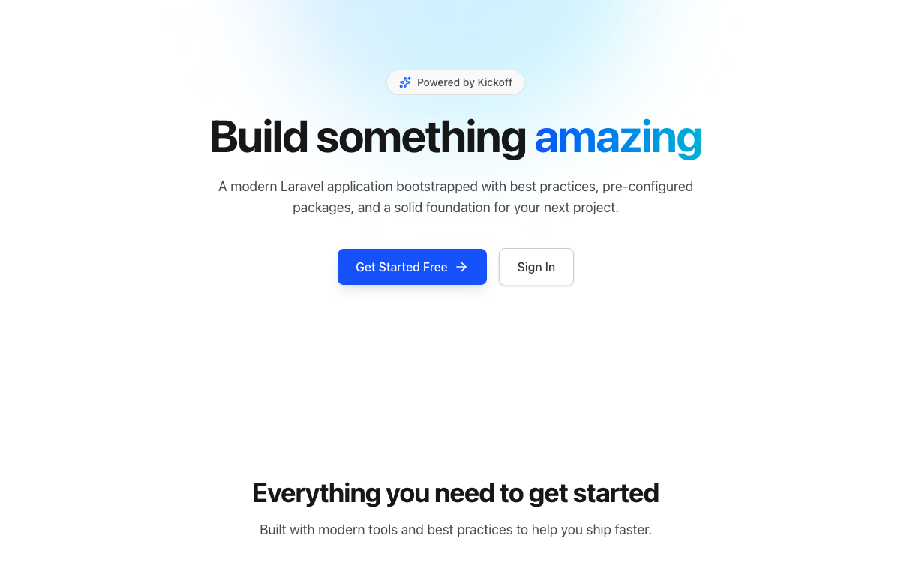
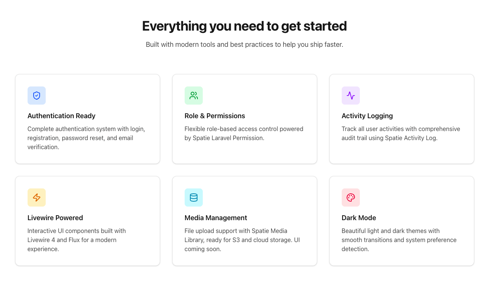

[](https://github.com/cleaniquecoders/laravel-starter/actions/workflows/lint.yml) [](https://github.com/cleaniquecoders/laravel-starter/actions/workflows/run-tests.yml)

# 🚀 Kickoff

This package bootstraps a **new Laravel project** with all the essential tools, configs, and workflows you need for a modern and maintainable setup.



## 🎯 Target Setup

Kickoff is designed for Laravel projects with this starter configuration:

```bash
laravel new myapp --git --livewire --pest --npm --livewire-class-components
```

**Includes:**

- ✅ Git repository initialization
- ✅ Livewire for reactive components
- ✅ Pest for testing
- ✅ NPM for asset management
- ✅ Livewire class-based components

The complete setup is based on [Project Template](https://github.com/nasrulhazim/project-template).

## 📥 Usage

### Quick Start

```bash
# 1. Install globally
composer global require cleaniquecoders/kickoff

# 2. Create Laravel project with the recommended setup
laravel new my-project --git --livewire --pest --npm --livewire-class-components
cd my-project

# 3. Bootstrap with kickoff
kickoff start <owner> <project-name>
```

**Complete Example:**

```bash
# Create project with full stack
laravel new blog --git --livewire --pest --npm --livewire-class-components
cd blog

# Apply kickoff configuration
kickoff start johndoe blog
```

### Options

- `<owner>` - Your name or organization (required)
- `<project-name>` - Project name (required)
- `<project-path>` - Project directory (optional, defaults to current directory)

### What Happens

```bash
🎉 Let's kickoff your johndoe/blog now!

⏳ Copy application stubs... ✅
⏳ Update composer.json... ✅
⏳ Update project files... ✅
⏳ Configure environment... ✅
⏳ Install packages... ✅
⏳ Build assets... ✅

🎉 Project setup completed successfully!
```

> ⚠️ **Warning**: Only run on fresh Laravel projects. Existing projects will be overwritten.

## ✨ Features



- 📦 Installs required Laravel packages:
  - [spatie/laravel-permission](https://spatie.be/docs/laravel-permission)
  - [spatie/laravel-medialibrary](https://spatie.be/docs/laravel-medialibrary)
  - [cleaniquecoders/traitify](https://github.com/cleaniquecoders/traitify)
  - [cleaniquecoders/laravel-media-secure](https://github.com/cleaniquecoders/laravel-media-secure)
  - [owen-it/laravel-auditing](https://laravel-auditing.com)

- 🛠 Dev tools:
  - [barryvdh/laravel-debugbar](https://github.com/barryvdh/laravel-debugbar)
  - [larastan/larastan](https://github.com/nunomaduro/larastan) for static analysis
  - [driftingly/rector-laravel](https://github.com/rectorphp/rector-laravel)
  - [pestphp/pest-plugin-arch](https://pestphp.com) for architecture testing

- ⚙️ Configuration:
  - Adds QA scripts to `composer.json`
  - Autoloads `support/helpers.php`
  - Creates `rector.php`, `phpstan.neon.dist`, and `pint.json`

- 📂 Project Structure:
  - `support/` for helpers
  - Refactored `routes/` into `web/`, `api/`, and `console/` subfolders (backups included)
  - `tinker/` with `.gitignore`
  - `docs/README.md` with a placeholder TOC

- 🛡️ Automation Scripts:
  - Creates executable scripts in `bin/` for tasks like backup, deployment, PHPStan reporting, dependency updates, and project install
  - All scripts use the current directory name as the project name

- ✅ Testing:
  - Generates `tests/Feature/ArchitectureTest.php` using Pest Arch

- 📝 Documentation:
  - Creates `CHANGELOG.md`, `CONTRIBUTING.md`, `CODE_OF_CONDUCT.md`, `SECURITY.md`, `SUPPORT.md`, and `LICENSE.md`

- ⚡ GitHub Actions Workflows:
  - Pint (Laravel Pint)
  - PHPStan
  - Rector
  - Tests (Pest)
  - Changelog updater

- 🔧 Artisan & Project Tasks:
  - Clears config and view caches
  - Runs migrations
  - Creates storage symlink
  - Publishes package configs and migrations

- 🛠️ Infrastructure Templates:
  - Sets up `.config/` with Nginx and Supervisor templates

## 📸 Screenshots

### Dashboard

The generated project includes a fully-featured admin dashboard with user statistics, quick actions, and system information.


### Role & Permissions Management

Manage roles with granular permissions using Spatie Laravel Permission.


### Settings Management

Configure application settings through an intuitive admin interface.


## 🧪 Development & Testing

### For Contributors

Test your changes to kickoff using the sandbox script:

```bash
# Create fresh Laravel app and apply kickoff
bin/sandbox run

# Inspect the generated project
cd test-output/sandbox
# create a database in mysql named `sandbox`
```

Then create tables & seed data:

```bash
php artisan reload:db
```

Run the sandbox app:

```bash
npm run build
php artisan serve
```

To clean up sandbox, run:

```bash
bin/sandbox reset
```

**Sandbox Features:**

- ✅ Automated testing workflow (30 seconds vs 10 minutes manually)
- ✅ Git-safe (uses skip-worktree to prevent accidental commits)
- ✅ Repeatable testing cycles
- ✅ Isolated test environment

**Requirements:**

- Laravel installer: `composer global require laravel/installer`

See `bin/sandbox` for detailed usage and commands.

## 🛡️ Automation Scripts

- Creates executable scripts in `bin/` for common project tasks:
  - **backup-app**: Backup your application files
  - **backup-media**: Backup only media files changed in the last 24 hours
  - **build-fe-assets**: Build and commit frontend assets
  - **deploy**: Deploy code to your server with branch/tag support
  - **update-dependencies**: Update Composer and npm dependencies, audit and build assets
  - **reinstall-npm**: Remove and reinstall npm modules and lock file
  - **install**: Project initialization, database setup, and environment configuration
  - **phpstan**: Run PHPStan and generate readable reports per identifier

- All scripts use the current directory name as the project name for dynamic configuration.
- Scripts are made executable and can be run directly from the `bin/` directory.

## Security Vulnerabilities

If you discover a security vulnerability within AirBox, please send an e-mail to Nasrul Hazim via [nasrulhazim.m@gmail.com](mailto:nasrulhazim.m@gmail.com). All security vulnerabilities will be promptly addressed.

## Contributors

<a href="https://github.com/cleaniquecoders/kickoff/graphs/contributors">
  
</a>

## License

The Laravel framework is open-sourced software licensed under the [MIT license](https://opensource.org/licenses/MIT).
